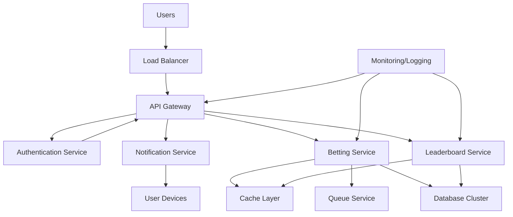

### **Functional Requirements**:
- **User Authentication**: Sign up, log in, and secure authentication via AuthService.
- **Betting Service**: Allow users to place bets, view match data, and manage their teams via BettingService.
- **Leaderboard**: Display real-time rankings and scores through LeaderboardService.
- **Notifications**: Notify users about match updates, betting status, and leaderboard changes.
- **API Gateway**: Route requests from users to appropriate services (Authentication, Betting, Leaderboard).
- **Database Management**: Store user data, bets, and match information in the Database Cluster.
- **Queue Management**: Handle asynchronous tasks and data processing via QueueService.
- **Caching**: Use CacheLayer for fast access to frequently requested data (e.g., leaderboards, match stats).

---

### **Non-Functional Requirements**:
- **Scalability**: Support up to 1 million concurrent users through Load Balancer and API Gateway.
- **High Availability**: Ensure system uptime of 99.9%, with redundancy and auto-scaling.
- **Performance**: APIs should respond within 2 seconds, handling high traffic loads.
- **Security**: Implement data encryption, secure authentication (AuthService), and secure transactions.
- **Fault Tolerance**: The system should recover from failures within minutes, with failover capabilities.
- **Monitoring & Logging**: Track system performance, errors, and usage via Monitoring/Logging for troubleshooting.
- **Data Consistency**: Ensure consistency in leaderboard rankings and bet data using DatabaseCluster and CacheLayer.
- **Latency**: Reduce latency by using CacheLayer and QueueService for faster data retrieval and processing.

---

#### 1. **Load Balancer**

- The load balancer distributes incoming user requests across multiple instances of the API Gateway and other services. This ensures no single server becomes overwhelmed, maintaining a smooth user experience even at peak traffic.

#### 2. **API Gateway**

- Central to routing requests, the API Gateway efficiently directs incoming traffic to appropriate services (authentication, betting, leaderboard, etc.). It can scale horizontally by adding more instances as the load increases.

#### 3. **Authentication Service**

- Responsible for login, registration, and token management. This service can be isolated and scaled independently since user sessions might be frequent but lightweight.

#### 4. **Betting and Leaderboard Services**

- The core business logic is managed by these two services. Both are stateless and can scale horizontally. Database and cache interactions are optimized to handle millions of bet transactions and leaderboard updates in real time.
- **Caching Layer (Redis/Memcached)** is used for frequently accessed data like live betting odds, leaderboard rankings, and user profiles to reduce database load.

#### 5. **Database Cluster**

- A horizontally scalable database cluster handles all persistent data. Sharding and replication are applied to ensure that read and write operations scale with the number of users.
- **Relational Databases** store transactional data such as user bets, payment records, and game outcomes.
- **NoSQL Databases** can store non-relational data like user activity logs, session data, and leaderboard statistics for faster retrieval.

#### 6. **Queue Service (Kafka/SQS)**

- Used to manage asynchronous tasks such as bet processing, leaderboard updates, and transaction history. This helps prevent bottlenecks in the system by offloading these tasks from real-time user-facing services.

#### 7. **Notification Service**

- Responsible for sending real-time updates (such as bet confirmation or leaderboard changes) to users. This service scales using message queues to handle spikes in demand.

#### 8. **Monitoring and Logging**

- Monitoring tools (e.g., Prometheus, Grafana) continuously track system performance metrics like response time, database load, and service uptime. Logs are stored in an ELK stack (Elasticsearch, Logstash, Kibana) to help quickly diagnose any issues.

#### 9. **Scalability Considerations**

- The microservices architecture ensures that each service can be scaled independently. For instance, during peak times (e.g., during popular matches), the betting and notification services can be scaled out rapidly.
- Horizontal scaling with auto-scaling policies in cloud infrastructure (e.g., AWS, Google Cloud) allows the system to automatically adjust based on real-time load.

---

